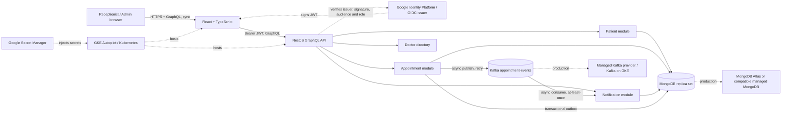

# Architecture

## Overview

The proof of concept is a **modular monolith**. The Patient, Appointment, Doctor, and Notification modules have separate schemas, services, and resolvers inside one NestJS deployment. One code-first GraphQL schema is composed from those modules; there is no schema gateway. This keeps the 6–8 hour vertical slice runnable while preserving domain boundaries. Notification consumption can be extracted later if throughput or independent availability warrants it.

Browser-to-API and API-to-Mongo operations are synchronous. Appointment events and notification creation are asynchronous. Local development runs the API, static React site, MongoDB replica set, and Kafka/Zookeeper with Docker Compose. A replica set is required for the transactional outbox.

## Request flow

1. The UI receives a short-lived access token from the configured identity provider and sends it as a Bearer token.
2. NestJS validates the JWT and enforces roles in the resolver guard. The frontend role selector only supports local presentation; it grants no authority.
3. Appointment booking verifies patient and doctor references, enforces a 30-minute start boundary, and writes the appointment and outbox row in one MongoDB transaction.
4. A MongoDB unique partial index arbitrates concurrent bookings for the same doctor and start time. A duplicate key becomes a GraphQL conflict.
5. The outbox publisher sends a versioned Kafka event. The Notification consumer inserts using `eventId` as a unique idempotency key.

## GCP deployment shape

Build immutable API and UI images with the GitHub Actions release workflow and publish them to Artifact Registry; deploy to GKE Autopilot as a separate operator-controlled step. Use an Ingress / HTTPS load balancer, separate deployments and services for UI and API, readiness/liveness probes, horizontal pod autoscaling, and rolling updates. Use Secret Manager with Workload Identity for credentials. Use managed MongoDB compatible with transaction requirements and a managed Kafka offering or Kafka on GKE; validate network, durability, and operational ownership before choosing. Send structured logs to Cloud Logging and metrics/traces to Cloud Monitoring/Cloud Trace. Roll back by redeploying the previous image digest / Helm release. This is a high-level target, not a deployed cloud environment.
